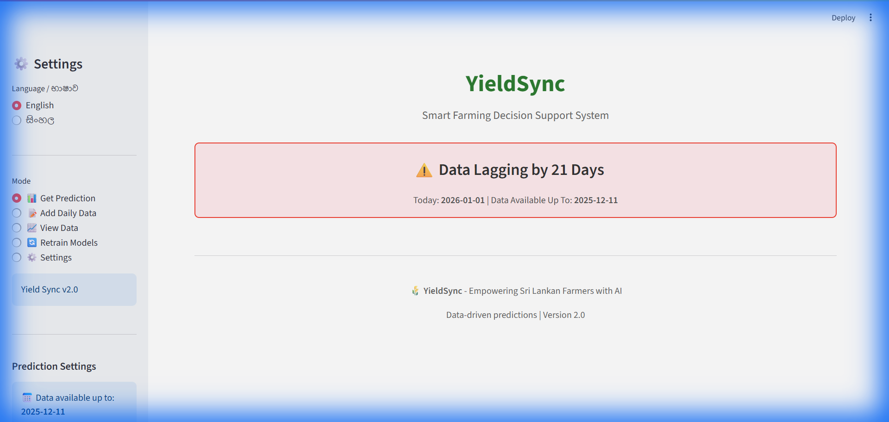
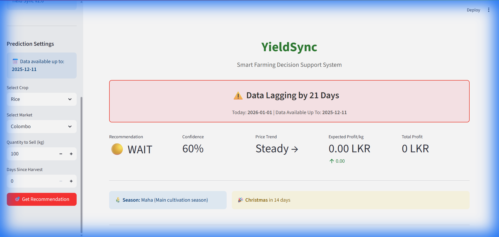
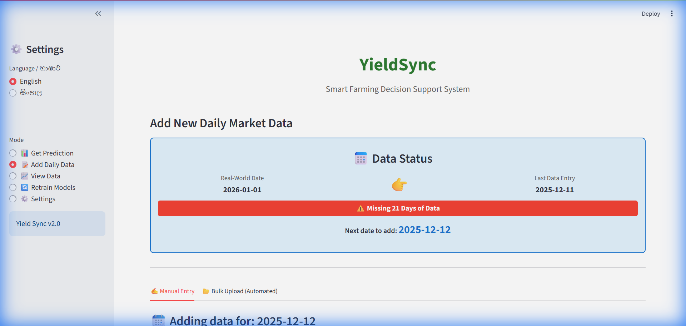
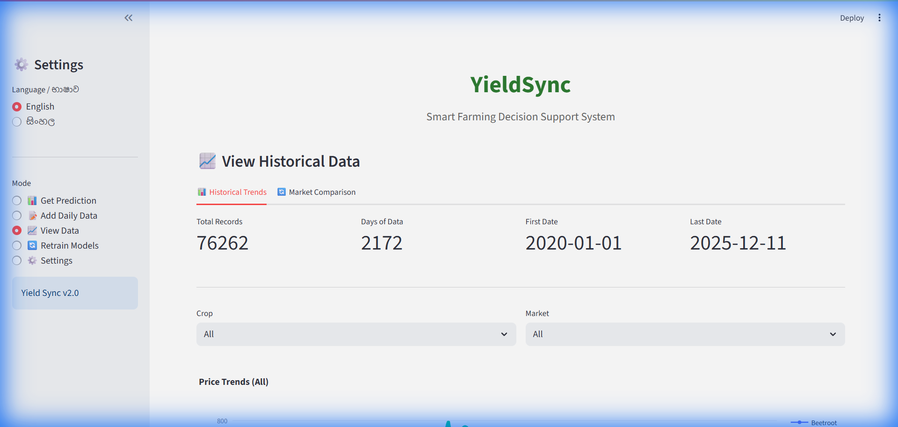
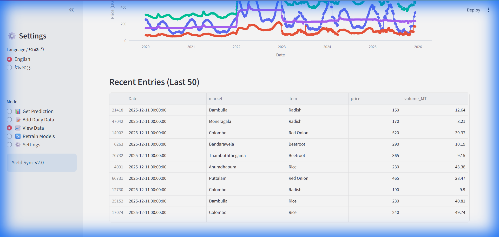

# 🌾 YieldSync - Smart Farming Price Prediction

> AI-powered price forecasting and market recommendations for Sri Lankan farmers



---

##  Features

### Price Prediction
- **Per-market models** - Separate AI model for each crop-market combination
- **Multi-horizon forecasting** - Predictions for 1 week, 2 weeks, 1 month, 2 months, 3 months
- **Profit-aware recommendations** - HOLD, SELL, or NEUTRAL based on economic analysis



###  Data Management

**Add Daily Data** - Manual entry or bulk upload (CSV/Excel)



**View Historical Data** - Price trends, charts, and data table





---

##  Quick Start

### Installation

```bash
# Clone the repository
git clone https://github.com/yourusername/Yield-Sync---Research-Project.git
cd Yield-Sync---Research-Project

# Install dependencies
pip install -r requirements.txt

# Run the app
streamlit run app/app.py
```

### Requirements

- Python 3.8+
- TensorFlow 2.x
- LightGBM
- Streamlit
- Pandas, NumPy, Scikit-learn

---

## Supported Crops & Markets

| Crop | Markets |
|------|---------|
| **Rice** | Colombo, Anuradhapura, Dambulla, Ampara, Kandy, Kurunegala, Moneragala, Polonnaruwa |
| **Beetroot** | Colombo, Thambuththegama, Bandarawela, Dambulla, Kandy, Nuwara Eliya |
| **Radish** | Colombo, Moneragala, Dambulla, Kandy, Meegoda |
| **Red Onion** | Colombo, Puttalam, Mullaittivu, Vavuniya, Batticaloa, Dambulla, Embilipitiya, Jaffna, Kandy, Mannar, Meegoda, Moneragala, Nuwara Eliya, Thambuththegama, Trincomalee |

---

##  Models

| Model Type | Crop | Features Used |
|------------|------|---------------|
| **LSTM** | Rice | Price lags (60 days) |
| **Random Forest** | Beetroot, Radish | Price + Weather features |
| **LightGBM** | Red Onion | Price + Weather features |

### Total Models: **190+**
- 20 demand models (4 crops × 5 horizons)
- 170 price models (34 crop-market combinations × 5 horizons)

---

##  Project Structure

```
Yield-Sync---Research-Project/
├── app/
│   ├── app.py           # Main Streamlit application
│   ├── config.py        # Crop-market configurations
│   ├── predictor.py     # Prediction and recommendation engine
│   └── trainer.py       # Model training logic
├── data/
│   ├── full_history_features_real_weather.csv
│   └── full_history_demand_data.csv
├── models/
│   └── saved_models/
│       ├── demand forcasting/
│       └── price forcasting/
├── notebooks/           # Research notebooks
├── docs/                # Documentation
│   └── images/          # Screenshots
└── requirements.txt
```

---

##  Recommendation Logic

| Profit Change | Recommendation | Meaning |
|---------------|----------------|---------|
| ≥ +10% | **STRONG HOLD** | Prices rising significantly, wait to sell |
| +2% to +10% | **HOLD** | Prices rising, wait for better price |
| -2% to +2% | **NEUTRAL** | Price stable, sell when convenient |
| -2% to -10% | **SELL** | Prices dropping, sell now |
| ≤ -10% | **STRONG SELL** | Prices dropping fast, sell immediately |

---

## Retraining Models

1. Go to **🔄 Retrain Models** mode
2. Click **Start Retraining**
3. Wait for training to complete (~30-60 minutes for all 190+ models)

---

##  Localization

The app supports:
- 🇬🇧 English
- 🇱🇰 Sinhala (සිංහල)

---

##  Documentation

- [Technical Documentation](docs/README.md)
- [Multi-Horizon Implementation](MULTI_HORIZON_IMPLEMENTATION.md)


